# ***_Parte 1_***

# Introducción al Desarrollo de Microservicios Usando Spring Boot

En esta primera parte del libro, aprenderás a usar algunas de las características más importantes de Spring Boot para desarrollar microservicios.

# Esta parte del libro incluye los siguientes capítulos:

-Capítulo 1, Introducción a los Microservicios

- Capítulo 2, Introducción a Spring Boot
- Capítulo 3, Creación de un Conjunto de Microservicios Cooperativos
- Capítulo 4, Despliegue de Nuestros Microservicios Usando Docker
- Capítulo 5, Adición de una Descripción de API Usando OpenAPI
- Capítulo 6, Adición de Persistencia
- Capítulo 7, Desarrollo de Microservicios Reactivos

## Capítulo 1: Introducción a los Microservicios

Este libro no alaba ciegamente los microservicios. En cambio, trata sobre cómo podemos usar sus beneficios mientras somos capaces de manejar los desafíos de construir microservicios escalables, resilientes y manejables.
Como introducción a este libro, los siguientes temas serán cubiertos en este capítulo:

- Mi camino hacia los microservicios
- ¿Qué es una arquitectura basada en microservicios?
- Desafíos con los microservicios
- Patrones de diseño para manejar desafíos
- Habilitadores de software que pueden ayudarnos a manejar estos desafíos
- Otras consideraciones importantes que no se cubren en este libro

### Requisitos técnicos

No se requieren instalaciones para este capítulo. Sin embargo, puede que te interese echar un vistazo a las convenciones del modelo C4, https://c4model.com, ya que las ilustraciones de este capítulo están inspiradas en el modelo C4.
Este capítulo no contiene ningún código fuente.

### Aprovechando al máximo este libro – conoce tus beneficios gratuitos

Desbloquea beneficios gratuitos exclusivos que vienen con tu compra, cuidadosamente diseñados para potenciar tu viaje de aprendizaje y ayudarte a aprender sin límites.

Aquí tienes una visión general rápida de lo que obtienes con este libro:

### Lector de última generación

Nuestro lector basado en web, diseñado para ayudarte a aprender efectivamente, viene con las siguientes características:

- Sincronización de progreso multidispositivo: Aprende desde cualquier dispositivo con sincronización de progreso sin interrupciones.
- Resaltado y toma de notas: Convierte tu lectura en conocimiento duradero.
- Marcadores: Revisita tus aprendizajes más importantes en cualquier momento.
- Modo oscuro: Concéntrate con mínima fatiga visual cambiando al modo oscuro o sepia.

### Asistente de IA interactivo (beta)

Nuestro asistente de IA interactivo ha sido entrenado con el contenido de este libro, para maximizar tu experiencia de aprendizaje. Viene con las siguientes características:

- Resumirlo: Resume secciones clave o un capítulo completo.
- Explicadores de código con IA: En el Packt Reader de última generación, haz clic en el botón "Explain" sobre cada bloque de código para obtener explicaciones de código impulsadas por IA.

`Nota: El asistente de IA es parte del Packt Reader de última generación y aún está en beta.`

### Versión PDF o ePub sin DRM

Aprende sin límites con los siguientes beneficios incluidos con tu compra:

- Aprende desde cualquier lugar con una copia en PDF sin DRM de este libro.
- Usa tu lector electrónico favorito para aprender usando una versión ePub sin DRM de este libro.

### Mi camino hacia los microservicios

Cuando conocí por primera vez el concepto de microservicios en 2014, me di cuenta de que había estado desarrollando microservicios (bueno, más o menos) durante varios años sin saber que eran microservicios con los que estaba tratando.
Estuve involucrado en un proyecto que comenzó en 2009 donde desarrollamos una plataforma basada en un conjunto de funcionalidades separadas. La plataforma se entregaba a varios clientes que la desplegaban on-premises. Para facilitar que los clientes pudieran elegir qué funcionalidades querían usar de la plataforma, cada funcionalidad se desarrolló como un componente de software autónomo; es decir, tenía sus propios datos persistentes y solo se comunicaba con otros componentes usando APIs bien definidas.

Como no puedo discutir características específicas de la plataforma de este proyecto, he generalizado los nombres de los componentes, los cuales están etiquetados desde el Componente A hasta el Componente F. La composición de la plataforma como un conjunto de componentes se ilustra de la siguiente manera:

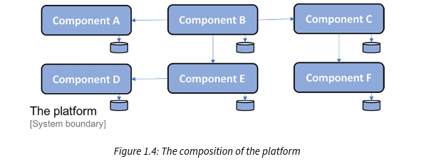

De la ilustración, también podemos ver que cada componente tiene su propio almacenamiento para datos persistentes y no comparte bases de datos con otros componentes.
Cada componente se desarrolla usando Java y el Spring Framework, se empaqueta como un archivo WAR y se despliega como una aplicación web en un contenedor web Java EE, por ejemplo, Apache Tomcat. Dependiendo de los requisitos específicos del cliente, la plataforma puede desplegarse en uno o varios servidores.
Un despliegue de dos nodos podría verse de la siguiente manera:

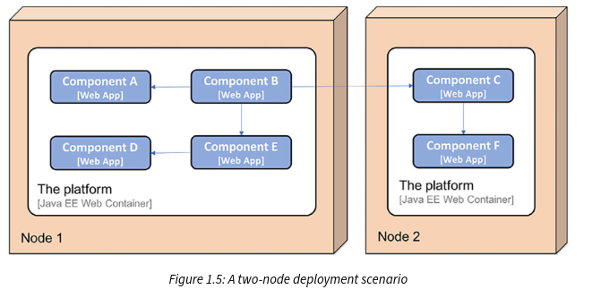

### Beneficios de los componentes de software autónomos

De este proyecto, aprendí que descomponer la funcionalidad de la plataforma en un conjunto de componentes de software autónomos proporciona varios beneficios:

- Un cliente puede desplegar partes de la plataforma en su propio paisaje de sistemas, integrándola con sus sistemas existentes usando sus APIs bien definidas.
- El siguiente es un ejemplo donde un cliente decidió desplegar el Componente A, el Componente B, el Componente D y el Componente E de la plataforma e integrarlos con dos sistemas existentes, el Sistema A y el Sistema B, en el paisaje de sistemas del cliente:

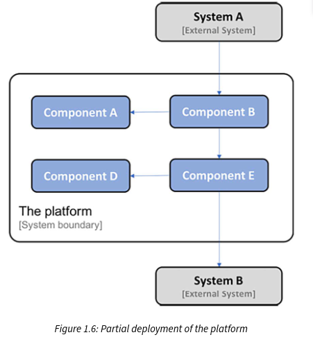

- Otro cliente podría optar por reemplazar partes de la funcionalidad de la plataforma con implementaciones que ya existen en el paisaje de sistemas del cliente, requiriendo potencialmente alguna adaptación de la funcionalidad existente a las APIs de la plataforma. El siguiente es un ejemplo donde un cliente ha reemplazado el Componente C y el Componente F de la plataforma con su propia implementación:

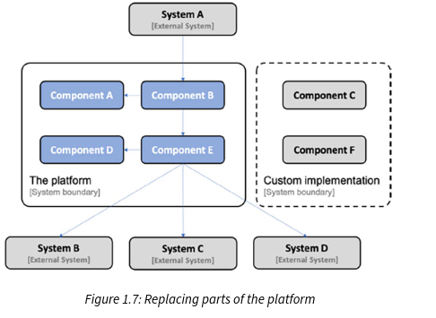

- Cada componente en la plataforma puede ser entregado y actualizado por separado. Gracias al uso de APIs bien definidas, un componente puede ser actualizado a una nueva versión sin depender del ciclo de vida de los otros componentes.
  El siguiente es un ejemplo donde el Componente A ha sido actualizado de la versión v1.1 a v1.2. El Componente B, que llama al Componente A, no necesita ser actualizado ya que usa una API bien definida; es decir, sigue siendo la misma después de la actualización (o al menos es compatible hacia atrás):

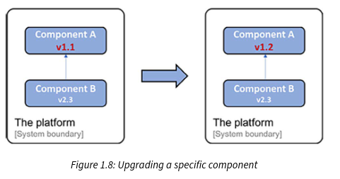

- Gracias al uso de APIs bien definidas, cada componente en la plataforma también puede escalarse horizontalmente a múltiples servidores de forma independiente de los otros componentes. El escalado puede hacerse ya sea para cumplir con requisitos de alta disponibilidad o para manejar volúmenes más altos de solicitudes. En este proyecto específico, se logró configurando manualmente balanceadores de carga frente a varios servidores, cada uno ejecutando un contenedor web Java EE. Un ejemplo donde el Componente A ha sido escalado a tres instancias se ve de la siguiente manera:

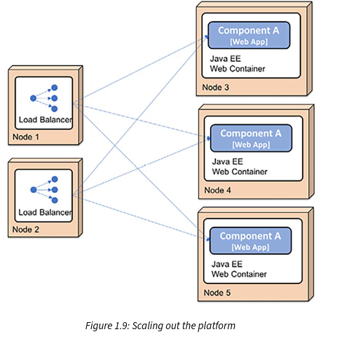

### Desafíos con los componentes de software autónomos

Mi equipo también aprendió que descomponer la plataforma introdujo varios desafíos nuevos a los que no estábamos expuestos (al menos no en el mismo grado) al desarrollar aplicaciones monolíticas más tradicionales:

- Agregar nuevas instancias a un componente requería configurar manualmente balanceadores de carga y configurar manualmente nuevos nodos. Este trabajo consumía mucho tiempo y era propenso a errores.
- La plataforma era inicialmente propensa a errores causados por otros sistemas con los que se comunicaba. Si un sistema dejaba de responder a las solicitudes enviadas desde la plataforma de manera oportuna, la plataforma se quedaba rápidamente sin recursos cruciales, por ejemplo, hilos del SO, especialmente cuando estaba expuesta a un gran número de solicitudes concurrentes. Esto causaba que los componentes en la plataforma se colgaran o incluso se bloquearan. Dado que la mayor parte de la comunicación en la plataforma se basaba en comunicación síncrona, un componente que fallara podía llevar a fallos en cascada; es decir, los clientes de los componentes que fallaban también podían fallar después de un tiempo. Esto se conoce como una cadena de fallos.
- Mantener la configuración en todas las instancias de los componentes consistente y actualizada rápidamente se convirtió en un problema, causando mucho trabajo manual y repetitivo. Esto llevó a problemas de calidad de vez en cuando.
- Monitorear el estado de la plataforma en términos de problemas de latencia y uso de hardware (por ejemplo, uso de CPU, memoria, discos y red) era más complicado en comparación con monitorear una sola instancia de una aplicación monolítica.
- Recopilar archivos de registro de varios componentes distribuidos y correlacionar eventos de registro relacionados de los componentes también era difícil, pero factible ya que el número de componentes era fijo y conocido de antemano.

Con el tiempo, abordamos la mayoría de los desafíos mencionados en la lista anterior con una combinación de herramientas desarrolladas internamente e instrucciones bien documentadas para manejar estos desafíos manualmente. La escala de la operación estaba, en general, en un nivel donde los procedimientos manuales para lanzar nuevas versiones de los componentes y manejar problemas en tiempo de ejecución eran aceptables, aunque no fueran deseables.

### El surgimiento de los microservicios

Aprender sobre arquitecturas basadas en microservicios en 2014 me hizo darme cuenta de que otros proyectos también habían estado lidiando con desafíos similares (en parte por otras razones diferentes a las que describí anteriormente, por ejemplo, los grandes proveedores de servicios en la nube cumpliendo con requisitos de escala web). Muchos pioneros de los microservicios habían publicado detalles de las lecciones que aprendieron. Fue muy interesante aprender de estas lecciones.

Muchos de los pioneros desarrollaron inicialmente aplicaciones monolíticas que los hicieron muy exitosos desde una perspectiva empresarial. Pero con el tiempo, estas aplicaciones monolíticas se volvieron cada vez más difíciles de mantener y evolucionar. También se volvieron difíciles de escalar más allá de las capacidades de las máquinas más grandes disponibles (también conocido como escalado vertical). Eventualmente, los pioneros comenzaron a encontrar formas de dividir las aplicaciones monolíticas en componentes más pequeños que pudieran lanzarse y escalarse independientemente unos de otros. Escalar componentes pequeños puede hacerse usando escalado horizontal, es decir, desplegando un componente en varios servidores más pequeños y colocando un balanceador de carga frente a ellos. Si se hace en la nube, la capacidad de escalado es potencialmente infinita – es solo cuestión de cuántos servidores virtuales incorpores (asumiendo que tu componente pueda escalarse horizontalmente en una gran cantidad de instancias, pero más sobre eso más adelante).

En 2014, también aprendí sobre varios proyectos nuevos de código abierto que ofrecían herramientas y frameworks que simplificaban el desarrollo de microservicios y podían usarse para manejar los desafíos que conlleva una arquitectura basada en microservicios. Algunos de estos son los siguientes:

- Pivotal lanzó Spring Cloud, que envuelve partes de Netflix OSS para proporcionar capacidades como descubrimiento dinámico de servicios, gestión de configuración, trazado distribuido, circuit breaking, y más.
- También aprendí sobre Docker y la revolución de los contenedores, que es excelente para minimizar la brecha entre desarrollo y producción. Poder empaquetar un componente no solo como un artefacto de runtime desplegable (por ejemplo, un archivo .war o .jar de Java) sino como una imagen completa, lista para ser lanzada como un contenedor en un servidor ejecutando Docker, fue un gran avance para el desarrollo y las pruebas.

`Por ahora, piensa en un contenedor como un proceso aislado. Aprenderemos más sobre contenedores en el Capítulo 4, Despliegue de Nuestros Microservicios Usando Docker.`

- Un motor de contenedores, como Docker, no es suficiente para poder usar contenedores en un entorno de producción. Se necesita algo que pueda asegurar que todos los contenedores estén funcionando y que pueda escalar contenedores en varios servidores, proporcionando así alta disponibilidad y mayores recursos de cómputo.
- Estos tipos de productos se conocieron como orquestadores de contenedores. Varios productos han evolucionado en los últimos años, como Apache Mesos, Docker en modo swarm, Amazon ECS, HashiCorp Nomad y Kubernetes. Kubernetes fue desarrollado inicialmente por Google. Cuando Google lanzó la v1.0 en 2015, también donó Kubernetes a la CNCF (https://www.cncf.io/). Durante 2018, Kubernetes se convirtió en una especie de estándar de facto, disponible tanto preempaquetado para uso on-premises como como servicio de la mayoría de los principales proveedores de nube.

`Como se explica en https://kubernetes.io/blog/2015/04/borg-predecessor-to-kubernetes/, Kubernetes es en realidad una reescritura de código abierto de un orquestador de contenedores interno, llamado Borg, utilizado por Google durante más de una década antes de que se fundara el proyecto Kubernetes.`

- En 2018, comencé a aprender sobre el concepto de una malla de servicios (service mesh) y cómo puede complementar a un orquestador de contenedores para descargar aún más responsabilidades de los microservicios con el fin de hacerlos manejables y resilientes.

### Un paisaje de microservicios de ejemplo

Dado que este libro no puede cubrir todos los aspectos de las tecnologías que acabo de mencionar, me centraré en las partes que han demostrado ser útiles en proyectos de clientes en los que he participado desde 2014. Describiré cómo se pueden usar juntas para crear microservicios cooperativos que sean manejables, escalables y resilientes.
Cada capítulo de este libro abordará un aspecto específico. Para demostrar cómo encajan las cosas, usaré un pequeño conjunto de microservicios cooperativos que evolucionaremos a lo largo de este libro. El paisaje de microservicios se describirá en el Capítulo 3, Creación de un Conjunto de Microservicios Cooperativos; por ahora, es suficiente saber que se ve así:

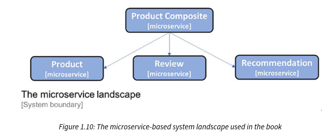

`Ten en cuenta que este es un paisaje de microservicios cooperativos muy pequeño. Los servicios de soporte circundantes que agregaremos en los próximos capítulos podrían parecer abrumadoramente complejos para estos pocos microservicios. Pero ten en cuenta que las soluciones presentadas en este libro tienen como objetivo respaldar un paisaje de sistemas mucho más grande.`

Ahora que hemos conocido los beneficios potenciales y los desafíos de los microservicios, comencemos a analizar cómo se puede definir un microservicio.

### Definición de un microservicio

Una arquitectura de microservicios consiste en dividir aplicaciones monolíticas en componentes más pequeños, lo que logra dos objetivos principales:

- Desarrollo más rápido, permitiendo despliegues continuos
- Más fácil de escalar, manual o automáticamente
  Un microservicio es esencialmente un componente de software autónomo que se puede actualizar, reemplazar y escalar de forma independiente. Para poder actuar como un componente autónomo, debe cumplir ciertos criterios, como los siguientes:
- Debe ajustarse a una arquitectura de no compartir nada (shared-nothing); es decir, ¡los microservicios no comparten datos en bases de datos entre sí!
- Solo debe comunicarse a través de interfaces bien definidas, ya sea usando API y servicios síncronos o, preferiblemente, enviando mensajes de forma asíncrona. Las API y los formatos de mensaje utilizados deben ser estables, estar bien documentados y evolucionar siguiendo una estrategia de versionado definida.
- Debe desplegarse como procesos de ejecución separados. Cada instancia de un microservicio se ejecuta en un proceso de ejecución separado, por ejemplo, un contenedor Docker.
- Las instancias de microservicios son sin estado (stateless), de modo que las solicitudes entrantes a un microservicio puedan ser manejadas por cualquiera de sus instancias.
  Usando un conjunto de microservicios cooperativos, podemos desplegar en varios servidores más pequeños en lugar de vernos obligados a desplegar en un solo servidor grande, como tenemos que hacer al desplegar una aplicación monolítica.
  Dado que se han cumplido los criterios anteriores, es más fácil escalar un solo microservicio a más instancias (por ejemplo, usando más servidores virtuales) en comparación con escalar una gran aplicación monolítica.
  Utilizar las capacidades de escalado automático disponibles en la nube también es una posibilidad, pero normalmente no es factible para una gran aplicación monolítica. También es más fácil actualizar o incluso reemplazar un solo microservicio en comparación con actualizar una gran aplicación monolítica. Esto se ilustra en el siguiente diagrama, donde una aplicación monolítica se ha dividido en seis microservicios, todos los cuales se han desplegado en servidores separados. Algunos de los microservicios también se han escalado de forma independiente de los demás:

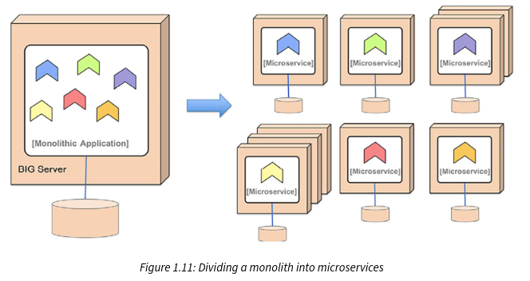

`Una pregunta muy frecuente que recibo de los clientes es:`

### ¿Qué tan grande debe ser un microservicio?

Intento usar las siguientes reglas generales:

- Lo suficientemente pequeño para que un desarrollador pueda mantenerlo bajo control
- Lo suficientemente grande para no comprometer el rendimiento (es decir, la latencia) y/o la consistencia de los datos (las claves foráneas SQL entre datos almacenados en diferentes microservicios ya no son algo que se pueda dar por sentado)

Entonces, para resumir, la arquitectura de microservicios es, en esencia, un estilo arquitectónico donde descomponemos una aplicación monolítica en un grupo de componentes de software autónomos cooperativos. La motivación es permitir un desarrollo más rápido y facilitar el escalado de la aplicación.
Con una mejor comprensión de cómo definir un microservicio, podemos avanzar y detallar los desafíos que conlleva un paisaje de sistemas de microservicios.

### Desafíos con los microservicios

En la sección Desafíos con los componentes de software autónomos, ya hemos visto algunos de los desafíos que los componentes de software autónomos pueden traer (y todos aplican también a los microservicios), como los siguientes:

- Muchos componentes pequeños que utilizan comunicación síncrona pueden causar un problema de cadena de fallos, especialmente bajo alta carga
- Mantener la configuración actualizada para muchos componentes pequeños puede ser un desafío
- Es difícil rastrear una solicitud que está siendo procesada e involucra muchos componentes, por ejemplo, al realizar un análisis de causa raíz, donde cada componente almacena registros de log localmente
- Analizar el uso de recursos de hardware a nivel de componente también puede ser un desafío
- La configuración y gestión manual de muchos componentes pequeños puede volverse costosa y propensa a errores

Otra desventaja (pero no siempre obvia inicialmente) de descomponer una aplicación en un grupo de componentes autónomos es que forman un sistema distribuido. Se sabe que los sistemas distribuidos son, por su naturaleza, muy difíciles de manejar. Esto se ha sabido durante muchos años (pero en muchos casos se ignoró hasta que se demostró lo contrario). Mi cita favorita para establecer este hecho es de Peter Deutsch, quien en 1994 declaró lo siguiente:

Las 8 falacias de la computación distribuida: Esencialmente todos, cuando construyen una aplicación distribuida por primera vez, hacen las siguientes ocho suposiciones. Todas resultan ser falsas a largo plazo y todas causan grandes problemas y experiencias de aprendizaje dolorosas: 0. La red es confiable

1. La red es confiable
2. La latencia es cero
3. El ancho de banda es infinito
4. La red es segura
5. La topología no cambia
6. Hay un solo administrador
7. El costo de transporte es cero
8. La red es homogénea

(Peter Deutsch, 1994)

En general, construir microservicios basados en estas suposiciones falsas lleva a soluciones que son propensas tanto a fallos temporales de red como a problemas que ocurren en otras instancias de microservicios. Cuando la cantidad de microservicios en un paisaje de sistemas aumenta, la probabilidad de problemas también aumenta. Una buena regla general es diseñar tu arquitectura de microservicios basándose en la suposición de que siempre hay algo que está saliendo mal en el paisaje de sistemas. La arquitectura de microservicios debe diseñarse para manejar esto, en términos de detectar problemas y reiniciar componentes fallidos. Además, en el lado del cliente, asegúrate de que las solicitudes no se envíen a instancias de microservicios fallidas. Cuando los problemas se corrigen, se deben reanudar las solicitudes al microservicio que anteriormente fallaba; es decir, los clientes de microservicios deben ser resilientes. Todo esto necesita, por supuesto, estar completamente automatizado. Con un gran número de microservicios, ¡no es factible que los operadores manejen esto manualmente!
El alcance de esto es amplio, pero nos limitaremos por ahora y pasaremos a aprender sobre patrones de diseño para microservicios.

### Patrones de diseño para microservicios

Este tema cubrirá el uso de patrones de diseño para mitigar los desafíos con los microservicios, como se describió en la sección anterior. Más adelante en este libro, veremos cómo podemos implementar estos patrones de diseño usando Spring Boot, Spring Cloud, Kubernetes e Istio.
El concepto de patrones de diseño es en realidad bastante antiguo; fue inventado por Christopher Alexander en 1977. En esencia, un patrón de diseño consiste en describir una solución reutilizable a un problema dado un contexto específico. Usar una solución probada y testeada de un patrón de diseño puede ahorrar mucho tiempo y aumentar la calidad de la implementación en comparación con dedicar tiempo a inventar la solución nosotros mismos.
Los patrones de diseño que cubriremos son los siguientes:

- Descubrimiento de servicios (Service discovery)
- Servidor de borde (Edge server)
- Microservicios reactivos (Reactive microservices)
- Configuración centralizada (Central configuration)
- Análisis centralizado de logs (Centralized log analysis)
- Trazado distribuido (Distributed tracing)
- Interruptor de circuito (Circuit breaker)
- Bucle de control (Control loop)
- Monitoreo y alarmas centralizados (Centralized monitoring and alarms)

`Esta lista no pretende ser exhaustiva; en cambio, es una lista mínima de patrones de diseño que se requieren para manejar los desafíos que describimos anteriormente.`

Usaremos un enfoque ligero para describir los patrones de diseño y nos centraremos en lo siguiente:

- El problema
- Una solución
- Requisitos para la solución

A lo largo de este libro, profundizaremos en cómo aplicar estos patrones de diseño. El contexto para estos patrones de diseño es un paisaje de sistemas de microservicios cooperativos donde los microservicios se comunican entre sí usando ya sea solicitudes síncronas (por ejemplo, usando HTTP) o enviando mensajes asíncronos (por ejemplo, usando un broker de mensajes).

### Descubrimiento de servicios (Service discovery)

El patrón de descubrimiento de servicios tiene el siguiente problema, solución y requisitos de solución.

### Problema

¿Cómo pueden los clientes encontrar microservicios y sus instancias? Las instancias de microservicios típicamente tienen asignadas direcciones IP asignadas dinámicamente cuando se inician, por ejemplo, cuando se ejecutan en contenedores. Esto dificulta que un cliente realice una solicitud a un microservicio que, por ejemplo, expone una API REST a través de HTTP. Considere el siguiente diagrama:

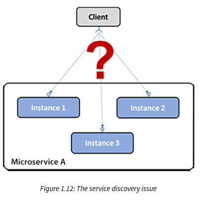

### Solución

Agregar un nuevo componente —un servicio de descubrimiento de servicios (service discovery service)— al paisaje de sistemas, que realice un seguimiento de los microservicios actualmente disponibles y las direcciones IP de sus instancias.

### Requisitos de la solución

Algunos requisitos de la solución son los siguientes:

- Registrar/dar de baja automáticamente microservicios y sus instancias a medida que aparecen y desaparecen.
- El cliente debe poder realizar una solicitud a un endpoint lógico para el microservicio. La solicitud será enrutada a una de las instancias de microservicio disponibles.
- Las solicitudes a un microservicio deben ser balanceadas entre las instancias disponibles.
- Debemos poder detectar instancias que actualmente no están saludables para que las solicitudes no sean enrutadas hacia ellas.

Notas de implementación: Como veremos en el Capítulo 9, Agregando Descubrimiento de Servicios Usando Netflix Eureka, el Capítulo 15, Introducción a Kubernetes, y el Capítulo 16, Desplegando Nuestros Microservicios en Kubernetes, este patrón de diseño se puede implementar usando dos estrategias diferentes:

- Enrutamiento del lado del cliente: El cliente usa una librería que se comunica con el servicio de descubrimiento de servicios para averiguar las instancias adecuadas a las que enviar las solicitudes.
- Enrutamiento del lado del servidor: La infraestructura del servicio de descubrimiento de servicios también expone un proxy inverso (reverse proxy) al que se envían todas las solicitudes. El proxy inverso reenvía las solicitudes a una instancia de microservicio adecuada en nombre del cliente.

### Servidor de borde (Edge server)

El patrón de servidor de borde tiene el siguiente problema, solución y requisitos de solución.

### Problema

En un paisaje de sistemas de microservicios, en muchos casos es deseable exponer algunos de los microservicios al exterior del paisaje de sistemas y ocultar los microservicios restantes del acceso externo. Los microservicios expuestos deben estar protegidos contra solicitudes de clientes maliciosos.

### Solución

Agregar un nuevo componente, un servidor de borde (edge server), al paisaje de sistemas por el que pasarán todas las solicitudes entrantes:

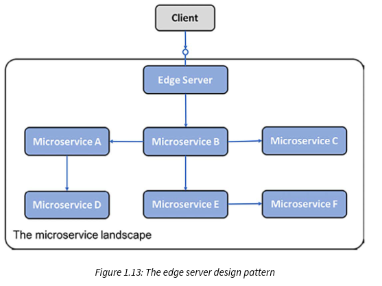

Notas de implementación: Un servidor de borde típicamente se comporta como un proxy inverso y puede integrarse con un servicio de descubrimiento para proporcionar capacidades dinámicas de balanceo de carga.

### Requisitos de la solución

Algunos requisitos de la solución son los siguientes:

- Ocultar los servicios internos que no deben exponerse fuera de su contexto; es decir, solo enrutar solicitudes a microservicios que estén configurados para permitir solicitudes externas.
- Exponer los servicios externos y protegerlos de solicitudes maliciosas; es decir, usar protocolos estándar y mejores prácticas como OAuth, OIDC, tokens JWT y claves API para asegurar que los clientes sean confiables.
  Microservicios reactivos (Reactive microservices)

El patrón de microservicios reactivos tiene el siguiente problema, solución y requisitos de solución.

### Problema

Tradicionalmente, como desarrolladores de Java, estamos acostumbrados a implementar comunicación síncrona usando I/O bloqueante (blocking I/O), por ejemplo, una API JSON RESTful a través de HTTP. Usar I/O bloqueante significa que un hilo (thread) es asignado del sistema operativo durante toda la duración de la solicitud. Si el número de solicitudes concurrentes aumenta, un servidor podría quedarse sin hilos disponibles en el sistema operativo, causando problemas que van desde tiempos de respuesta más largos hasta servidores que se caen. Usar una arquitectura de microservicios típicamente empeora este problema, donde normalmente se utiliza una cadena de microservicios cooperativos para atender una solicitud. Cuantos más microservicios estén involucrados en atender una solicitud, más rápido se agotarán los hilos disponibles.

### Solución

Usar I/O no bloqueante (non-blocking I/O) para asegurar que no se asignen hilos del sistema operativo mientras se espera que ocurra el procesamiento en otro servicio, es decir, una base de datos u otro microservicio, por ejemplo, usando un modelo de programación reactiva como Project Reactor o usando virtual threads.

### Requisitos de la solución

Algunos requisitos de la solución son los siguientes:

- Siempre que sea factible, usar un modelo de programación asíncrona, enviando mensajes sin esperar a que el receptor los procese.
- Si se prefiere un modelo de programación síncrona, usar frameworks reactivos que puedan ejecutar solicitudes síncronas usando I/O no bloqueante, sin asignar un hilo mientras se espera una respuesta. Esto hará que los microservicios sean más fáciles de escalar para manejar una carga de trabajo aumentada.
- Los microservicios también deben estar diseñados para ser resilientes y auto-curativos (self-healing). Resiliente significa ser capaz de producir una respuesta incluso si uno de los servicios del que depende falla; auto-curativo significa que una vez que el servicio fallido vuelve a estar operativo, el microservicio debe poder reanudar su uso.

En 2013, los principios clave para diseñar sistemas reactivos fueron establecidos en El Manifiesto Reactivo (https://www.reactivemanifesto.org/).

`Según el manifiesto, la base de los sistemas reactivos es que están impulsados por mensajes (message-driven); utilizan comunicación asíncrona. Esto les permite ser elásticos —es decir, escalables— y resilientes —es decir, tolerantes a fallos. La elasticidad y la resiliencia juntas permiten que un sistema reactivo siempre responda de manera oportuna.`

### Configuración centralizada (Central configuration)

El patrón de configuración centralizada tiene el siguiente problema, solución y requisitos de solución.

### Problema

Una aplicación se despliega, tradicionalmente, junto con su configuración, por ejemplo, un conjunto de variables de entorno y/o archivos que contienen información de configuración. Dado un paisaje de sistemas basado en una arquitectura de microservicios, es decir, con un gran número de instancias de microservicios desplegadas, surgen algunas preguntas:

- ¿Cómo obtengo una imagen completa de la configuración que está vigente para todas las instancias de microservicios en ejecución?
- ¿Cómo actualizo la configuración y me aseguro de que todas las instancias de microservicios afectadas se actualicen correctamente?

### Solución

Agregar un nuevo componente, un servidor de configuración (configuration server), al paisaje de sistemas para almacenar la configuración de todos los microservicios, como se ilustra en el siguiente diagrama:

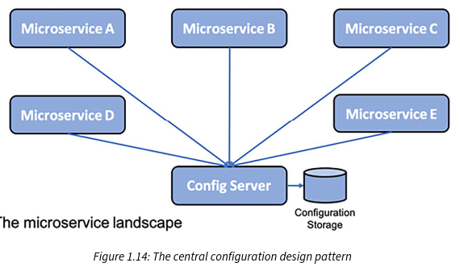

### Requisitos de la solución

Hacer posible almacenar información de configuración para un grupo de microservicios en un solo lugar, con diferentes ajustes para diferentes entornos (por ejemplo, dev, test, qa y prod).
Análisis centralizado de logs (Centralized log analysis)
El análisis centralizado de logs tiene el siguiente problema, solución y requisitos de solución.

### Problema

Tradicionalmente, una aplicación escribiría eventos de log en archivos de log que se almacenan en el sistema de archivos local del servidor en el que se ejecuta la aplicación. Dado un paisaje de sistemas basado en una arquitectura de microservicios, es decir, con un gran número de instancias de microservicios desplegadas en un gran número de servidores más pequeños, podemos plantear las siguientes preguntas:

- ¿Cómo obtengo una visión general de lo que está sucediendo en el paisaje de sistemas cuando cada instancia de microservicio escribe en su propio archivo de log local?
- ¿Cómo detecto si alguna de las instancias de microservicio tiene problemas y comienza a escribir mensajes de error en sus archivos de log?
- Si los usuarios finales comienzan a reportar problemas, ¿cómo puedo encontrar los mensajes de log relacionados; es decir, cómo puedo identificar qué instancia de microservicio es la causa raíz del problema? El siguiente diagrama ilustra el

### problema:

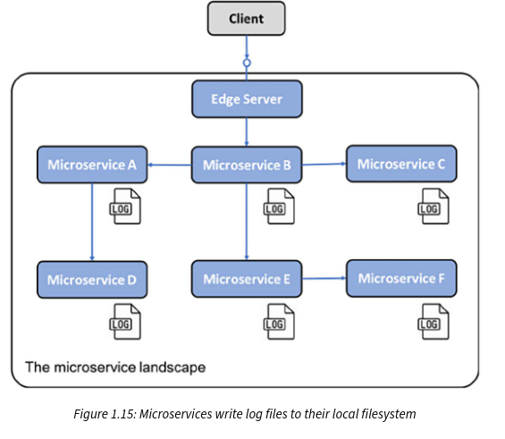

### Solución

Agregar un nuevo componente que pueda gestionar el logging centralizado y sea capaz de lo siguiente:

- Detectar nuevas instancias de microservicios y recolectar eventos de log de ellas
- Interpretar y almacenar eventos de log de forma estructurada y buscable en una base de datos central
- Proporcionar APIs y herramientas gráficas para consultar y analizar eventos de log

### Requisitos de la solución

Algunos requisitos de la solución son los siguientes:

- Los microservicios transmiten (stream) eventos de log a la salida estándar del sistema, stdout. Esto facilita que un recolector de logs encuentre los eventos de log en comparación con cuando los eventos de log se escriben en archivos de log específicos del microservicio.
- Los microservicios etiquetan los eventos de log con el ID de correlación (correlation ID) descrito en la siguiente sección sobre el patrón de diseño de trazado distribuido.
- Se define un formato de log canónico, para que los recolectores de logs puedan transformar los eventos de log recolectados de los microservicios a un formato de log canónico antes de que los eventos de log se almacenen en la base de datos central. Almacenar eventos de log en un formato de log canónico es necesario para poder consultar y analizar los eventos de log recolectados.

### Trazado distribuido (Distributed tracing)

El trazado distribuido tiene el siguiente problema, solución y requisitos de solución.

### Problema

Debe ser posible rastrear solicitudes y mensajes que fluyen entre microservicios mientras se procesa una solicitud externa al paisaje de sistemas.
Algunos ejemplos de escenarios de fallo son los siguientes:

- Si los usuarios finales comienzan a abrir casos de soporte sobre un fallo específico, ¿cómo podemos identificar el microservicio que causó el problema, es decir, la causa raíz?
- Si un caso de soporte menciona problemas relacionados con una entidad específica, por ejemplo, un número de pedido específico, ¿cómo podemos encontrar mensajes de log relacionados con el procesamiento de este pedido específico por ejemplo, mensajes de log de todos los microservicios que estuvieron involucrados en su procesamiento?
- Si los usuarios finales comienzan a abrir casos de soporte sobre un tiempo de respuesta inaceptablemente largo, ¿cómo podemos identificar qué microservicio en una cadena de llamadas está causando la demora?

El siguiente diagrama representa esto:
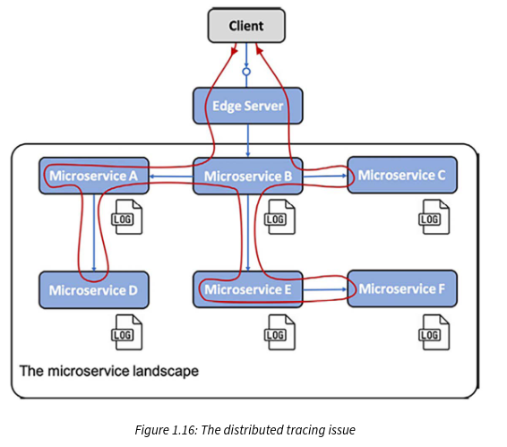

### Solución

Para rastrear el procesamiento entre microservicios cooperativos, necesitamos asegurar que todas las solicitudes y mensajes relacionados estén marcados con un ID de correlación común y que el ID de correlación sea parte de todos los eventos de log. Basándonos en un ID de correlación, podemos usar el servicio de logging centralizado para encontrar todos los eventos de log relacionados. Si uno de los eventos de log también incluye información sobre un identificador relacionado con el negocio, por ejemplo, el ID de un cliente, producto o pedido, podemos encontrar todos los eventos de log relacionados para ese identificador de negocio usando el ID de correlación.
Para poder analizar demoras en una cadena de llamadas de microservicios cooperativos, debemos poder recopilar marcas de tiempo de cuándo las solicitudes, respuestas y mensajes entran y salen de cada microservicio.

### Requisitos de la solución

Los requisitos de la solución son los siguientes:

- Asignar IDs de correlación únicos a todas las solicitudes y eventos entrantes o nuevos en un lugar bien conocido, como un encabezado con un nombre estandarizado
- Cuando un microservicio realiza una solicitud saliente o envía un mensaje, debe agregar el ID de correlación a la solicitud y al mensaje
- Todos los eventos de log deben incluir el ID de correlación en un formato predefinido para que el servicio de logging centralizado pueda extraer el ID de correlación del evento de log y hacerlo buscable
- Se deben crear registros de traza (trace records) para cuando las solicitudes, respuestas y mensajes entran o salen de una instancia de microservicio

### Interruptor de circuito (Circuit breaker)

El patrón de interruptor de circuito tiene el siguiente problema, solución y requisitos de solución.

### Problema

Un paisaje de sistemas de microservicios que utiliza intercomunicación síncrona puede estar expuesto a una cadena de fallos. Si un microservicio deja de responder, sus clientes podrían también tener problemas y dejar de responder a las solicitudes de sus clientes. El problema puede propagarse recursivamente a través de un paisaje de sistemas y afectar a grandes partes del mismo.

Esto es especialmente común en los casos en que las solicitudes síncronas se ejecutan usando I/O bloqueante, es decir, bloqueando un hilo del sistema operativo subyacente mientras se procesa una solicitud. Combinado con un gran número de solicitudes concurrentes y un servicio que comienza a responder inesperadamente lento, los pools de hilos pueden agotarse rápidamente, causando que el llamante se cuelgue y/o se caiga. Este fallo puede propagarse desagradablemente rápido al llamante del llamante, y así sucesivamente.

### Solución

Agregar un interruptor de circuito (circuit breaker) que evite nuevas solicitudes salientes de un llamante si detecta un problema con el servicio al que llama.

### Requisitos de la solución

Los requisitos de la solución son los siguientes:

- Abrir el circuito y fallar rápido (fail fast, sin esperar un timeout) si se detectan problemas con el servicio.
- Sondear para la corrección del fallo (también conocido como circuito medio abierto, half-open circuit); es decir, permitir que una sola solicitud pase de forma regular para ver si el servicio está operando normalmente nuevamente.
- Cerrar el circuito si la sonda detecta que el servicio está operando normalmente nuevamente. Esta capacidad es muy importante ya que hace que el paisaje de sistemas sea resiliente a este tipo de problemas; en otras palabras, se auto-cura (self-heals).

El siguiente diagrama ilustra un escenario donde toda la comunicación síncrona dentro del paisaje de sistemas de microservicios pasa a través de interruptores de circuito. Todos los interruptores de circuito están cerrados; permiten el tráfico, excepto un interruptor de circuito (para el Microservicio E) que ha detectado problemas en el servicio al que van las solicitudes. Por lo tanto, este interruptor de circuito está abierto y utiliza lógica de fallo rápido; es decir, no llama al servicio fallido ni espera a que ocurra un timeout. En su lugar, el Microservicio E puede devolver inmediatamente una respuesta, aplicando opcionalmente alguna lógica de respaldo (fallback logic) antes de responder:

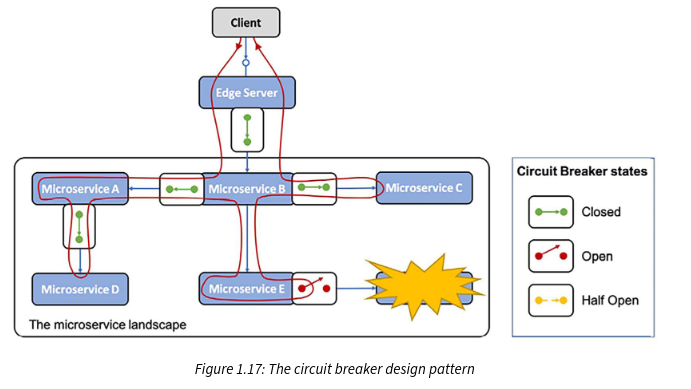

### Bucle de control (Control loop)

El patrón de bucle de control tiene el siguiente problema, solución y requisitos de solución.

### Problema

En un paisaje de sistemas con un gran número de instancias de microservicios repartidas en varios servidores, es muy difícil detectar y corregir manualmente problemas como instancias de microservicios que se han caído o colgado.

### Solución

Agregar un nuevo componente, un bucle de control (control loop), al paisaje de sistemas. Este proceso se ilustra de la siguiente manera:

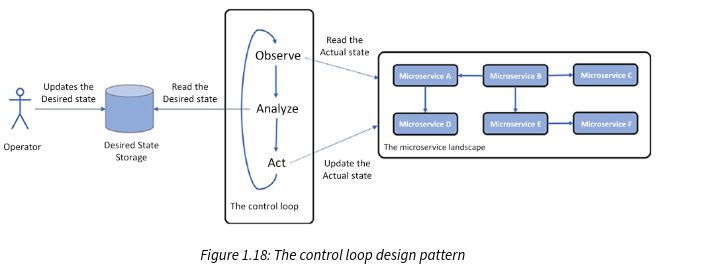

### Requisitos de la solución

El bucle de control observará constantemente el estado real del paisaje de sistemas, comparándolo con un estado deseado, según lo especificado por los operadores. Si los dos estados difieren, tomará medidas para hacer que el estado real sea igual al estado deseado.

#### Notas de implementación: En el mundo de los contenedores, un orquestador de contenedores como Kubernetes se usa típicamente para implementar este patrón. Aprenderemos más sobre Kubernetes en el Capítulo 15, Introducción a Kubernetes.

### Monitoreo y alarmas centralizados (Centralized monitoring and alarms)

Para este patrón, tenemos el siguiente problema, solución y requisitos de solución.

### Problema

Si los tiempos de respuesta observados y/o el uso de recursos de hardware se vuelven inaceptablemente altos, puede ser muy difícil descubrir la causa raíz del problema. Por ejemplo, necesitamos poder analizar el consumo de recursos de hardware por microservicio.

### Solución

Para mitigar esto, agregamos un nuevo componente, un servicio de monitor (monitor service), al paisaje de sistemas, que sea capaz de recopilar métricas sobre el uso de recursos de hardware a nivel de cada instancia de microservicio.

### Requisitos de la solución

Los requisitos de la solución son los siguientes:

- Debe ser capaz de recopilar métricas de todos los servidores que utiliza el paisaje de sistemas, lo que incluye servidores de autoescalado (autoscaling)
- Debe ser capaz de detectar nuevas instancias de microservicios a medida que se lanzan en los servidores disponibles y comenzar a recopilar métricas de ellas
- Debe ser capaz de proporcionar APIs y herramientas gráficas para consultar y analizar las métricas recopiladas
- Debe ser posible definir alertas que se activen cuando una métrica especificada supere un valor umbral especificado

La siguiente captura de pantalla muestra Grafana, que visualiza métricas de Prometheus, una herramienta de monitoreo que veremos en el Capítulo 20, Monitoreo de Microservicios:

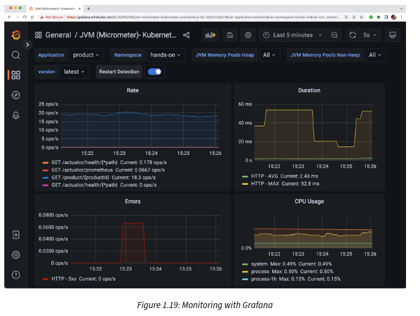

¡Esa fue una lista extensa! Estoy seguro de que estos patrones de diseño te ayudaron a entender mejor los desafíos de los microservicios. A continuación, pasaremos a aprender sobre habilitadores de software.

### Habilitadores de software (Software enablers)

Como ya hemos mencionado, tenemos una serie de herramientas de código abierto muy buenas que pueden ayudarnos tanto a cumplir con nuestras expectativas de los microservicios como, lo más importante, a manejar los nuevos desafíos que conllevan:

- Spring Boot, un framework de aplicaciones
- Spring Cloud/Netflix OSS, una combinación de framework de aplicaciones y servicios listos para usar
- Docker, una herramienta para ejecutar contenedores en un solo servidor
- Kubernetes, un orquestador de contenedores que gestiona un clúster de servidores que ejecutan contenedores
- Istio, una implementación de malla de servicios (service mesh)

La siguiente tabla mapea los patrones de diseño que necesitaremos para manejar estos desafíos, junto con la herramienta de código abierto correspondiente que se utilizará en este libro para implementar los patrones de diseño:

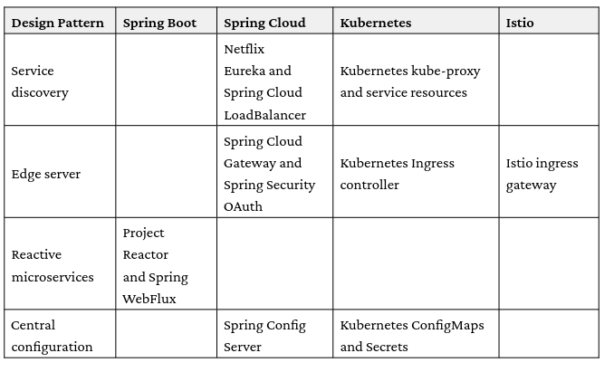

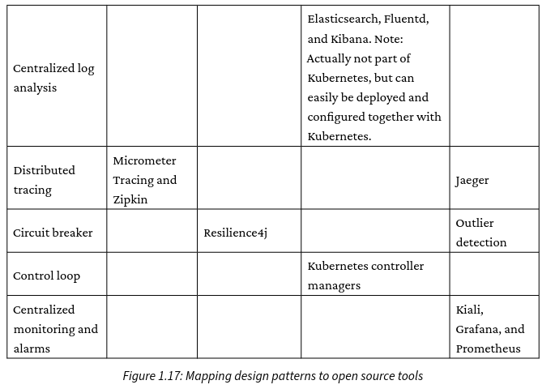

Tenga en cuenta que Spring Cloud, Kubernetes o Istio se pueden usar para implementar algunos patrones de diseño, como el descubrimiento de servicios, el servidor de borde y la configuración centralizada. Discutiremos los pros y los contras de usar estas opciones más adelante en este libro.

Habiendo presentado los patrones de diseño y las herramientas que usaremos en el libro, cerraremos este capítulo repasando algunas áreas relacionadas que también son importantes, pero que no se cubren en este libro.

### Otras consideraciones importantes

Para tener éxito en la implementación de una arquitectura de microservicios, hay una serie de áreas relacionadas a considerar. No cubriré estas áreas en este libro; en su lugar, las mencionaré brevemente aquí:

- Importancia de DevOps: Uno de los beneficios de una arquitectura de microservicios es que permite tiempos de entrega más cortos y, en casos extremos, permite la entrega continua de nuevas versiones. Para poder entregar tan rápido, necesitas establecer una organización donde dev y ops trabajen juntos bajo el mantra lo construiste, lo ejecutas (you built it, you run it). Esto significa que los desarrolladores ya no pueden simplemente pasar nuevas versiones del software al equipo de operaciones. En su lugar, los equipos de dev y ops necesitan trabajar mucho más estrechamente juntos, organizados en equipos que tengan la responsabilidad total del ciclo de vida completo de un microservicio (o un grupo de microservicios relacionados). Además de la parte organizativa de dev y ops, los equipos también necesitan automatizar la cadena de entrega, es decir, los pasos para construir, probar, empaquetar y desplegar los microservicios en los diversos entornos de despliegue. Esto se conoce como configurar un pipeline de entrega (delivery pipeline).
- Aspectos organizativos y la ley de Conway: Otro aspecto interesante de cómo una arquitectura de microservicios podría afectar a la organización es la ley de Conway, que establece lo siguiente:

`"Cualquier organización que diseña un sistema (definido ampliamente) producirá un diseño cuya estructura es una copia de la estructura de comunicación de la organización."
(Melvyn Conway, 1967)`

Esto significa que el enfoque tradicional de organizar los equipos de TI para aplicaciones grandes basándose en su experiencia tecnológica (por ejemplo, equipos de UX, lógica de negocio y base de datos) conducirá a una gran aplicación de tres capas —típicamente, una gran aplicación monolítica con una unidad desplegable por separado para la interfaz de usuario, otra para procesar la lógica de negocio y otra para la gran base de datos. Para entregar con éxito una aplicación basada en una arquitectura de microservicios, la organización necesita cambiarse a equipos que trabajen con uno o un grupo de microservicios relacionados. El equipo debe tener las habilidades que se requieren para esos microservicios, por ejemplo, lenguajes y frameworks para la lógica de negocio y tecnologías de base de datos para persistir sus datos.

- Descomponer una aplicación monolítica en microservicios: Una de las decisiones más difíciles (y costosa si se hace mal) es cómo descomponer una aplicación monolítica en un conjunto de microservicios cooperativos. Si esto se hace de la manera incorrecta, terminarás con problemas como los siguientes:
- Entrega lenta: Los cambios en los requisitos del negocio afectarán a demasiados microservicios, resultando en trabajo extra
- Mal rendimiento: Para poder realizar una función de negocio específica, es necesario pasar muchas solicitudes entre varios microservicios, resultando en tiempos de respuesta largos
- Datos inconsistentes: Dado que los datos relacionados están separados en diferentes microservicios, pueden aparecer inconsistencias con el tiempo en los datos gestionados por diferentes microservicios

Un buen enfoque para encontrar los límites adecuados para los microservicios es aplicar el diseño impulsado por el dominio (domain-driven design) y su concepto de contextos delimitados (bounded contexts). Según Eric Evans, un contexto delimitado es:

`"Una descripción de un límite (típicamente un subsistema, o el trabajo de un equipo en particular) dentro del cual un modelo particular es definido y aplicable."`

Esto significa que un microservicio definido por un contexto delimitado tendrá un modelo bien definido de sus propios datos.

- Importancia del diseño de APIs: Si un grupo de microservicios expone una API común disponible externamente, es importante que la API sea fácil de entender y cumpla con las siguientes pautas:
- Si el mismo concepto se usa en múltiples APIs, debe tener la misma descripción en términos de nomenclatura y tipos de datos utilizados.
- Es de gran importancia que se permita que las APIs evolucionen de manera independiente pero controlada. Esto típicamente requiere aplicar un esquema de versionado adecuado para las APIs, por ejemplo, https://semver.org/. Esto implica soportar múltiples versiones principales (major versions) de una API durante un período de tiempo específico, permitiendo que los clientes de la API migren a nuevas versiones principales a su propio ritmo.
- Rutas de migración desde on-premises a la nube: Muchas empresas hoy en día ejecutan sus cargas de trabajo on-premises, pero están buscando maneras de mover partes de su carga de trabajo a la nube. Dado que la mayoría de los proveedores de nube ofrecen hoy Kubernetes como servicio, un enfoque de migración atractivo puede ser primero mover la carga de trabajo a Kubernetes on-premises (como microservicios o no) y luego redesplegarla en una oferta de Kubernetes-como-servicio proporcionada por un proveedor de nube preferido.
- Buenos principios de diseño para microservicios – la aplicación de 12 factores (12-factor app): La aplicación de 12 factores (https://12factor.net) es un conjunto de principios de diseño para construir software que pueda desplegarse en la nube. La mayoría de estos principios de diseño son aplicables para construir microservicios independientemente de dónde y cómo se desplieguen, es decir, en la nube o on-premises. Algunos de estos principios se cubrirán en este libro, como configuración, procesos y logs, pero no todos.

¡Eso es todo para el primer capítulo! Espero que te haya dado una buena idea básica de los microservicios y los desafíos que conllevan, así como una visión general de lo que cubriremos en este libro.

### Resumen

En este capítulo introductorio, describí mi propio camino hacia los microservicios y profundicé un poco en su historia. Definimos qué es un microservicio —un tipo de componente distribuido autónomo con algunos requisitos específicos. También repasamos tanto los aspectos buenos como los desafiantes de la arquitectura basada en microservicios.

Para manejar estos desafíos, definimos un conjunto de patrones de diseño y mapeamos brevemente las capacidades de productos de código abierto como Spring Boot, Spring Cloud, Kubernetes e Istio con los patrones de diseño.

Ya estás ansioso por desarrollar tu primer microservicio, ¿verdad? En el próximo capítulo, se te presentará Spring Boot y herramientas complementarias de código abierto que usaremos para desarrollar nuestros primeros microservicios.